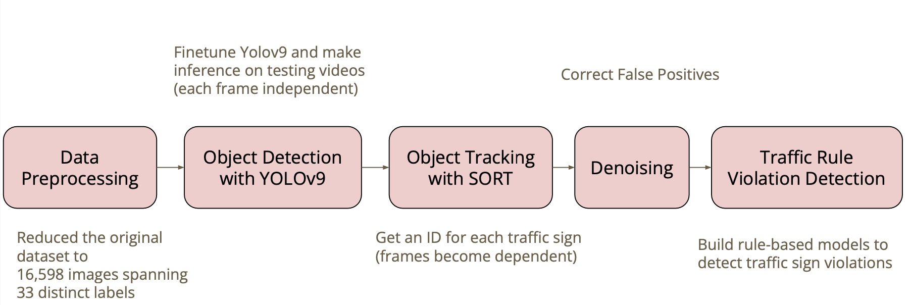
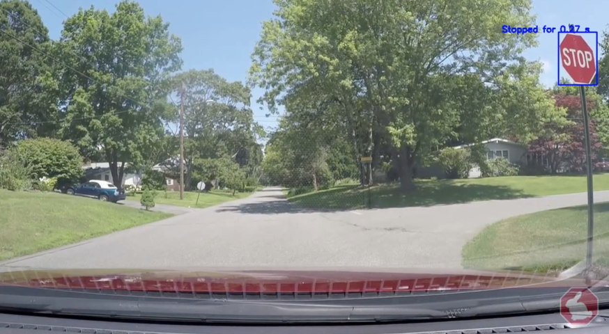

# Traffic Violation Detection
## Abstract
Current literature on traffic violation detection rely on CCTVs, but in our project we target detecting traffic rule violations given a dashcam setup. Employing the real-time object detection capabilities of the YOLO model, augmented with tracking methods for precise temporal analysis, our system aims to improve driver awareness and adherence to traffic laws.

## Dataset
Our research utilizes the Mapillary Traffic Sign Dataset (MTSD), which is among the most comprehensive datasets available for traffic sign detection in academic research. This dataset includes street-level images from diverse geographic locations, featuring a broad spectrum of scenes and conditions. It comprises over 313 unique traffic sign classes and more than 250,000 annotated signs [[1]](#1).

## Pipeline

1.Finetune Yolo
2.Make Inference for each frame on testing video
3.SORT Item Tracking Algorithm
4.Denoise
 a.only keep IDs that appear more than 20 times 
 b.For predictions of same ID, take the mode as the class prediction (otherwise there might be more than one class predictions) 
5.Violation Detection

Please see more details in report \& presentation.

## Result Demo
To evaluate the effectiveness of our traffic rule violation detection algorithm, we analyzed two specific scenarios involving stop signs.

The first scenario demonstrates a driver who correctly stops at a stop sign. The dashcam captures the stop sign with a blue bounding box and the label ”Stopped for 0.27s”. This indicates that our algorithm successfully detected the stop sign and verified that the vehicle remained stationary for the required duration.

The second scenario involves a driver who fails to stop at the stop sign. The dashcam captures the stop sign with a red bounding box and the label ”Moving”. This indicates that our algorithm correctly identified the traffic violation by detecting that the vehicle did not come to a complete stop.

## Reference
<a id="1">[1]</a> 
Mapillary AB. Mapillary vistas dataset. https: / / www . mapillary . com / dataset / vistas, 2017.
